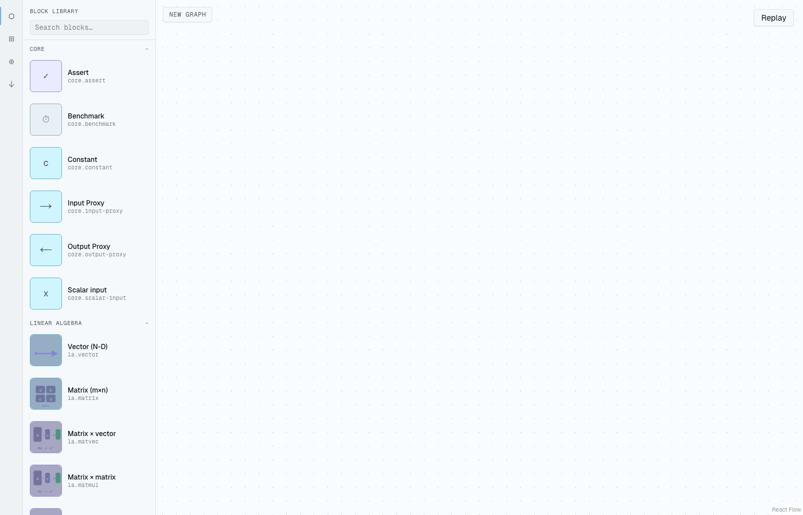
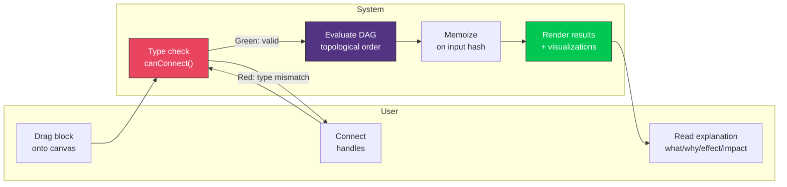
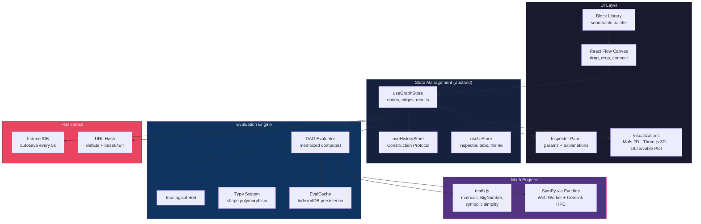
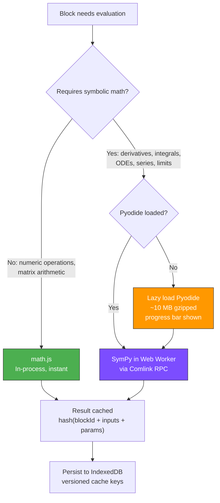
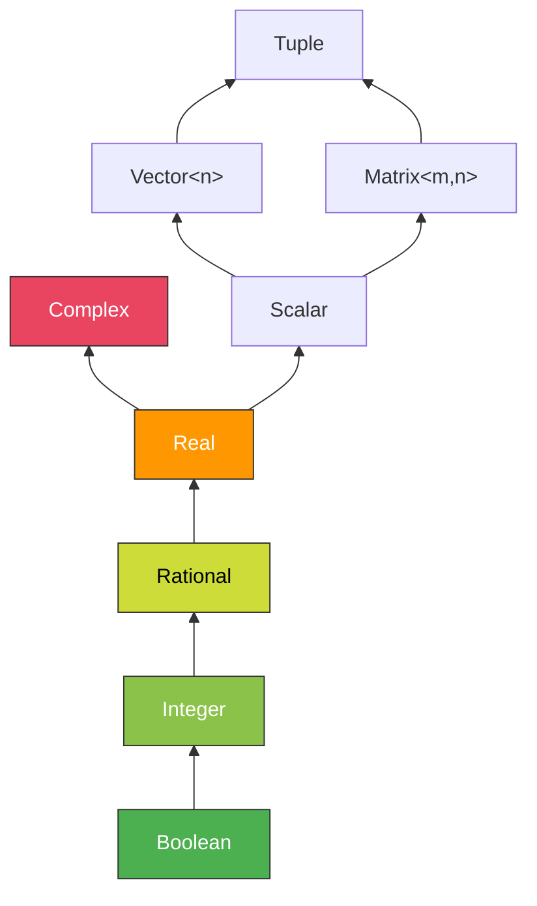
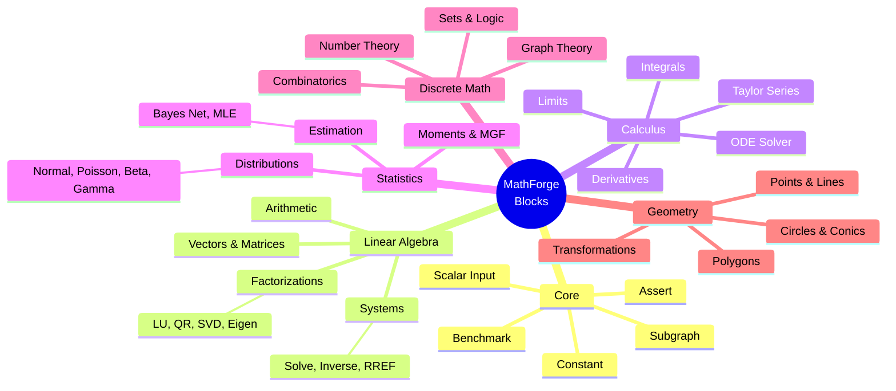
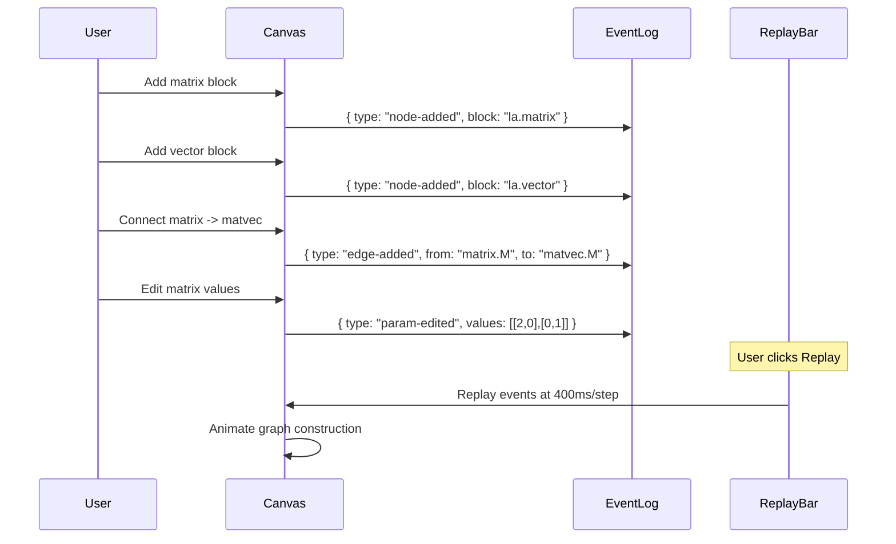

<div align="center">

# MathForge

**A visual canvas for composing mathematics as type-safe directed graphs of blocks.**

Build mathematics instead of reading it. Every mathematical object -- scalar, vector, matrix, distribution, function -- is a typed, draggable block. Connect blocks through shape-checked handles. The graph evaluates reactively. Each block explains itself: **what / why / effect / impact**.

<br>

[](https://github.com/k1bot2026/MathForge/actions/workflows/ci.yml)
[](docs/ROADMAP.md)
[](https://nextjs.org/)
[](https://react.dev/)
[](https://www.typescriptlang.org/)
[](https://www.sympy.org/)
[](LICENSE)

</div>

---

## Screenshots

<div align="center">

### Visual Graph Editor


*Matrix-vector multiplication pipeline with live unit grid visualization. Drag blocks from the library, connect them through typed handles, and see results update instantly.*

</div>

---

## How It Works

MathForge is a **visual programming environment for mathematics**. Instead of writing formulas in LaTeX or code, you construct them as directed graphs:

1. **Drag** a block from the library onto the canvas (e.g., `la.matrix`, `la.eigen`)
2. **Connect** blocks by drawing edges between typed handles
3. **See** results update reactively as the graph evaluates
4. **Learn** by reading the four-tab explanation panel: what / why / effect / impact

The system prevents invalid connections at draw-time -- you can't feed a `Matrix<3,3>` into a port expecting a `Scalar`. Shape mismatches show red feedback with an explanation.



---

## Architecture



### Dual Math Engine Strategy

MathForge uses two math engines with different strengths:



| Engine | Use Case | Performance | Size |
|---|---|---|---|
| **math.js** | Matrix ops, BigNumber, fractions, symbolic simplify | Instant (in-process) | ~500 KB |
| **SymPy via Pyodide** | Derivatives, integrals, ODEs, limits, series, MGF | ~50-200 ms per call (Web Worker) | ~10 MB (lazy) |

---

## Type System & Shape Polymorphism

MathForge enforces mathematical correctness at **connection time**, not evaluation time. You can't draw an invalid edge.

### Type Hierarchy



**Field subtyping:** $\mathbb{B} \subset \mathbb{Z} \subset \mathbb{Q} \subset \mathbb{R} \subset \mathbb{C}$

A `Boolean` output can connect to any `Integer`, `Rational`, `Real`, or `Complex` input -- the type system widens automatically.

### Shape Variables

Blocks like `la.matmul` use **shape variables** for generic dimension checking:

$$\texttt{la.matmul}: \text{Matrix}\langle m, k \rangle \times \text{Matrix}\langle k, n \rangle \rightarrow \text{Matrix}\langle m, n \rangle$$

When you connect a $3 \times 4$ matrix to the first input, the system binds $m = 3, k = 4$. The second input now only accepts matrices with 4 rows. This is verified at edge-draw time:

$$\text{unify}(\text{Shape}(k_1), \text{Shape}(k_2)) = \begin{cases} \text{bind}(k, n) & \text{if compatible} \\ \text{reject} & \text{if } k_1 \neq k_2 \end{cases}$$

### Connection Validation

| Visual Feedback | Meaning |
|---|---|
| **Green glow** | Types match, connection accepted |
| **Red + tooltip** | Type mismatch (e.g., `Matrix` to `Scalar`) |
| **Yellow warning** | Soft mismatch (precision downgrade: `exact` to `approximate`) |

---

## Example Formulas & Theorems

### 1. Eigendecomposition

Build a working eigendecomposition pipeline from scratch in under five minutes:

$$A = P \Lambda P^{-1} \qquad \text{where } \Lambda = \text{diag}(\lambda_1, \lambda_2, \ldots, \lambda_n)$$

```
[la.matrix A]  -->  [la.eigen]  -->  eigenvalues: lambda_1, lambda_2, ...
     3x3                 |
                         +-->  eigenvectors: P
                         +-->  [viz.unit-grid-3d]  -->  principal axes visualization
```

The eigenvalue equation that each block computes:

$$A\mathbf{v} = \lambda\mathbf{v} \quad \Rightarrow \quad \det(A - \lambda I) = 0$$

For a $2 \times 2$ matrix $A = \begin{pmatrix} a & b \\ c & d \end{pmatrix}$, the characteristic polynomial is:

$$\lambda^2 - (a+d)\lambda + (ad - bc) = 0$$

$$\lambda_{1,2} = \frac{(a+d) \pm \sqrt{(a+d)^2 - 4(ad-bc)}}{2}$$

### 2. Singular Value Decomposition (SVD)

$$A = U \Sigma V^T$$

where $U$ is $m \times m$ orthogonal, $\Sigma$ is $m \times n$ diagonal with singular values $\sigma_i$, and $V$ is $n \times n$ orthogonal. The singular values are the square roots of the eigenvalues of $A^T A$:

$$\sigma_i = \sqrt{\lambda_i(A^T A)} \qquad \kappa(A) = \frac{\sigma_{\max}}{\sigma_{\min}}$$

### 3. Solving ODEs Symbolically

Using SymPy via Pyodide, MathForge solves ordinary differential equations:

$$\frac{dy}{dx} + P(x) \cdot y = Q(x)$$

**Integrating factor method** (computed by `calc.dsolve`):

$$\mu(x) = e^{\int P(x)\,dx} \qquad y(x) = \frac{1}{\mu(x)} \left[ \int \mu(x) \cdot Q(x)\,dx + C \right]$$

### 4. Bayesian Inference

$$P(A \mid B) = \frac{P(B \mid A) \cdot P(A)}{P(B)} = \frac{P(B \mid A) \cdot P(A)}{\sum_{i} P(B \mid A_i) \cdot P(A_i)}$$

### 5. Taylor Series Expansion

The `calc.taylor` block computes symbolic Taylor series via SymPy:

$$f(x) = \sum_{n=0}^{N} \frac{f^{(n)}(a)}{n!}(x - a)^n + O\left((x-a)^{N+1}\right)$$

**Examples:**

$$e^x \approx 1 + x + \frac{x^2}{2!} + \frac{x^3}{3!} + \frac{x^4}{4!} + \frac{x^5}{5!}$$

$$\sin(x) \approx x - \frac{x^3}{3!} + \frac{x^5}{5!} - \frac{x^7}{7!} + \cdots$$

### 6. Moment Generating Functions (MGF)

The `stats.mgf` block computes MGFs via SymPy:

$$M_X(t) = E[e^{tX}] = \int_{-\infty}^{\infty} e^{tx} f_X(x)\,dx$$

| Distribution | MGF $M_X(t)$ | Domain |
|---|---|---|
| **Bernoulli($p$)** | $1 - p + pe^t$ | $t \in \mathbb{R}$ |
| **Binomial($n, p$)** | $(1 - p + pe^t)^n$ | $t \in \mathbb{R}$ |
| **Poisson($\lambda$)** | $e^{\lambda(e^t - 1)}$ | $t \in \mathbb{R}$ |
| **Normal($\mu, \sigma^2$)** | $e^{\mu t + \frac{1}{2}\sigma^2 t^2}$ | $t \in \mathbb{R}$ |
| **Exponential($\lambda$)** | $\frac{\lambda}{\lambda - t}$ | $t < \lambda$ |
| **Gamma($\alpha, \beta$)** | $\left(\frac{\beta}{\beta - t}\right)^{\alpha}$ | $t < \beta$ |

Moments are extracted by differentiation:

$$E[X^n] = M_X^{(n)}(0) = \left.\frac{d^n}{dt^n} M_X(t)\right|_{t=0}$$

---

## Core Algorithms

### Topological Sort (DAG Evaluation Order)

The evaluator uses **Kahn's algorithm** to determine execution order:

```
Algorithm: TOPOLOGICAL_SORT(nodes, edges)
------------------------------------------
  in_degree <- count incoming edges per node
  queue     <- all nodes with in_degree = 0
  order     <- []

  WHILE queue is not empty:
      node <- queue.dequeue()
      order.push(node)
      FOR each outgoing edge (node -> target):
          in_degree[target] -= 1
          IF in_degree[target] == 0:
              queue.enqueue(target)

  IF |order| != |nodes|:
      ERROR "Cycle detected in graph"

  RETURN order
```

### Memoized Evaluation

Each block is evaluated only when its inputs change:

$$\text{cacheKey}(b) = \text{hash}\big(\text{blockId}(b) \;\|\; \text{inputHashes}(b) \;\|\; \text{paramHash}(b)\big)$$

```
Algorithm: EVALUATE_DAG(graph)
-------------------------------
  order <- TOPOLOGICAL_SORT(graph.nodes, graph.edges)
  
  FOR node IN order:
      inputs  <- resolve(node.inputEdges, results)
      key     <- hash(node.id, inputs, node.params)
      
      IF cache.has(key):
          results[node.id] <- cache.get(key)
          CONTINUE
      
      IF node.block.isAsync:          // SymPy blocks
          result <- AWAIT node.block.compute(inputs, node.params)
      ELSE:                           // math.js blocks
          result <- node.block.compute(inputs, node.params)
      
      cache.set(key, result)
      results[node.id] <- result

  RETURN results
```

### Shape Unification Algorithm

When connecting two handles, the type system unifies shape variables:

$$\text{unify}: (\text{Shape}, \text{Shape}, \text{Bindings}) \rightarrow \text{Bindings} \cup \{\bot\}$$

```
Algorithm: UNIFY_SHAPE(s1, s2, bindings)
-----------------------------------------
  IF s1 is concrete AND s2 is concrete:
      RETURN s1 == s2 ? bindings : REJECT

  IF s1 is variable { var: name }:
      IF bindings[name] exists:
          RETURN UNIFY_SHAPE(bindings[name], s2, bindings)
      RETURN bindings + { name -> s2 }

  IF s2 is variable { var: name }:
      RETURN UNIFY_SHAPE(s1, s2, bindings)  // symmetric

  // Both composite (e.g., Matrix<m,n>)
  IF s1.tag != s2.tag: RETURN REJECT
  FOR (d1, d2) IN zip(s1.dims, s2.dims):
      bindings <- UNIFY_SHAPE(d1, d2, bindings)
      IF bindings == REJECT: RETURN REJECT
  RETURN bindings
```

### LU Decomposition with Partial Pivoting

The `la.lu` block implements Doolittle's algorithm:

$$PA = LU$$

$$L = \begin{pmatrix} 1 & 0 & \cdots & 0 \\ l_{21} & 1 & \cdots & 0 \\ \vdots & \vdots & \ddots & \vdots \\ l_{n1} & l_{n2} & \cdots & 1 \end{pmatrix} \qquad U = \begin{pmatrix} u_{11} & u_{12} & \cdots & u_{1n} \\ 0 & u_{22} & \cdots & u_{2n} \\ \vdots & \vdots & \ddots & \vdots \\ 0 & 0 & \cdots & u_{nn} \end{pmatrix}$$

### Gram-Schmidt Orthogonalization (QR Decomposition)

$$\mathbf{u}_k = \mathbf{a}_k - \sum_{j=1}^{k-1} \text{proj}_{\mathbf{u}_j}(\mathbf{a}_k) \qquad \text{where} \quad \text{proj}_{\mathbf{u}}(\mathbf{a}) = \frac{\langle \mathbf{a}, \mathbf{u} \rangle}{\langle \mathbf{u}, \mathbf{u} \rangle} \mathbf{u}$$

$$Q = \begin{pmatrix} \hat{\mathbf{u}}_1 & \hat{\mathbf{u}}_2 & \cdots & \hat{\mathbf{u}}_n \end{pmatrix} \qquad R = Q^T A$$

### Gauss-Jordan Elimination (RREF)

$$\begin{pmatrix} 2 & 1 & -1 & | & 8 \\ -3 & -1 & 2 & | & -11 \\ -2 & 1 & 2 & | & -3 \end{pmatrix} \xrightarrow{\text{RREF}} \begin{pmatrix} 1 & 0 & 0 & | & 2 \\ 0 & 1 & 0 & | & 3 \\ 0 & 0 & 1 & | & -1 \end{pmatrix}$$

---

## Block Library

MathForge ships with **100+ blocks** across 6 mathematical domains:



---

## Construction Protocol (Replay)

Every graph mutation generates a `ConstructionEvent` in an append-only log. This enables a "watch it build itself" replay:



---

## Tech Stack

<div align="center">


</div>

| Layer | Technology | Purpose |
|---|---|---|
| **Framework** | Next.js 16 (App Router) | Server components, routing |
| **UI** | React 19 + Tailwind v4 + shadcn/ui | Component library |
| **Canvas** | React Flow v12 (`@xyflow/react`) | Node graph editor |
| **State** | Zustand 5 + Immer | Immutable state management |
| **Numeric Math** | math.js 15 | Matrices, BigNumber, fractions, simplify |
| **Symbolic Math** | SymPy via Pyodide 0.29 | Derivatives, integrals, ODEs, limits |
| **2D Plots** | Mafs | Mathematical function plotting |
| **3D Viz** | react-three-fiber + drei | Matrix transformation visualization |
| **Stats Plots** | Observable Plot | Histograms, PDF/CDF overlays |
| **Math Input** | MathLive 0.109 | Interactive expression editing |
| **Math Display** | KaTeX | Formula rendering |
| **Animation** | Framer Motion | Transitions and micro-interactions |
| **Storage** | idb-keyval (IndexedDB) | Persistent evaluation cache |
| **Compression** | fflate | URL-encoded graph sharing |
| **Testing** | Vitest + fast-check + Playwright | Unit, property-based, and E2E |
| **Stories** | Storybook 10 | Component documentation |
| **Quality** | Biome 2.4 | Lint + format (replaces ESLint) |
| **Deploy** | Vercel | Preview deploys + CI |

---

## Getting Started

```bash
git clone https://github.com/k1bot2026/MathForge.git
cd MathForge

pnpm install
pnpm dev          # http://localhost:3000
```

### Commands

| Command | Description |
|---|---|
| `pnpm dev` | Development server with HMR |
| `pnpm build` | Production build |
| `pnpm test` | Vitest (unit + property-based tests) |
| `pnpm test:e2e` | Playwright E2E tests |
| `pnpm storybook` | Storybook on :6006 |
| `pnpm typecheck` | `tsc --noEmit` |
| `pnpm lint` | Biome check |

---

## Project Structure

```
MathForge/
├── src/
│   ├── app/                    # Next.js routes
│   ├── blocks/                 # Block definitions (heart of the system)
│   │   ├── linear-algebra/     # 17 LA blocks
│   │   ├── statistics/         # 25+ stats blocks
│   │   ├── calculus/           # 20+ calculus blocks
│   │   ├── discrete/           # 25+ discrete math blocks
│   │   ├── geometry/           # 30+ geometry blocks
│   │   ├── common/             # Core utility blocks
│   │   ├── registry.ts         # Block registry runtime
│   │   └── types.ts            # BlockDefinition, ParamSpec
│   ├── editor/                 # React Flow canvas + inspector
│   │   ├── canvas.tsx          # Main editor component
│   │   ├── block-library.tsx   # Left panel, drag-drop source
│   │   ├── inspector/          # Right rail (params + explanations)
│   │   ├── nodes/              # Block node renderers
│   │   └── connections.ts      # Type-checked edge validation
│   ├── engine/                 # Evaluation engine
│   │   ├── evaluator.ts        # DAG evaluator with memoization
│   │   ├── topo.ts             # Topological sort
│   │   ├── cache.ts            # IndexedDB evaluation cache
│   │   ├── workers/            # Pyodide Web Worker
│   │   └── construction-events.ts  # Replay protocol
│   ├── math/                   # Type system + engine adapters
│   │   ├── types.ts            # MathValue, MathType, Field, Shape
│   │   ├── mathjs-adapter.ts   # math.js wrapper
│   │   └── sympy-adapter.ts    # Pyodide client wrapper
│   └── store/                  # Zustand stores
│       ├── graph-store.ts      # Graph + evaluation state
│       ├── history-store.ts    # Construction Protocol
│       └── ui-store.ts         # UI workspace state
├── docs/                       # Design documents
│   ├── ARCHITECTURE.md
│   ├── PROJECT_VISION.md
│   ├── TYPES.md
│   ├── BLOCK_TAXONOMY.md
│   ├── BLOCK_AUTHORING_GUIDE.md
│   └── ROADMAP.md
├── tests/                      # Cross-cutting tests
├── e2e/                        # Playwright E2E
└── .storybook/                 # Storybook config
```

---

## Roadmap

```mermaid
gantt
    title MathForge Development Phases
    dateFormat X
    axisFormat %s

    section Foundation
    Phase 0 - Bootstrap        :done, p0, 0, 1
    Phase 1 - PoC Pipeline     :done, p1, 1, 2

    section Math Domains
    Phase 2 - Linear Algebra   :done, p2, 2, 3
    Phase 3 - Calculus         :done, p3, 3, 4
    Phase 4 - Statistics       :done, p4, 4, 5
    Phase 5 - Composite Blocks :done, p5, 5, 6
    Phase 6 - Discrete Math    :done, p6, 6, 7
    Phase 7 - Optimization     :done, p7, 7, 8

    section Current
    Phase 8 - Geometry         :active, p8, 8, 9

    section Future
    Phase 9 - Cloud Sync       :p9, 9, 10
```



| Phase | Domain | Blocks | Status |
|:---:|---|:---:|:---:|
| **0** | Bootstrap (toolchain, CI, Storybook) | -- | Done |
| **1** | PoC matrix transformation pipeline | 5 | Done |
| **2** | Linear algebra (eigen, SVD, LU, QR, RREF) | 17 | Done |
| **3** | Calculus (derivatives, integrals, ODEs, Taylor) | 20+ | Done |
| **4** | Statistics (distributions, Bayes, MGF) | 25+ | Done |
| **5** | Composite blocks (user-defined subgraphs) | 3 | Done |
| **6** | Discrete math (sets, graphs, combinatorics) | 25+ | Done |
| **7** | Optimization (LP, convex) | 10+ | Done |
| **8** | Geometry (points, lines, circles, transforms) | 30+ | Active |
| **9** | Cloud sync (Supabase, slug URLs) | -- | Planned |

---

## Design Principles

- **Build, don't read.** Mathematics is learned by constructing, not by staring at static notation
- **Type errors at draw-time.** Invalid connections are prevented before evaluation, not caught as runtime crashes
- **Explain everything.** Every block carries a four-tab explanation: what / why / effect / impact
- **Lazy symbolic math.** SymPy loads on demand -- the app is instant for numeric operations
- **Local-first.** Graphs autosave to IndexedDB. No account required. URL sharing via compressed hash

---

## Documentation

Full design and architecture docs in `docs/`:

| Document | Purpose |
|---|---|
| [PROJECT_VISION.md](docs/PROJECT_VISION.md) | What we're building and why |
| [ARCHITECTURE.md](docs/ARCHITECTURE.md) | System design and data flow |
| [TYPES.md](docs/TYPES.md) | Type system and shape polymorphism |
| [BLOCK_TAXONOMY.md](docs/BLOCK_TAXONOMY.md) | Every block with type signatures |
| [BLOCK_AUTHORING_GUIDE.md](docs/BLOCK_AUTHORING_GUIDE.md) | How to add a new block |
| [TESTING.md](docs/TESTING.md) | Property testing with fast-check + SymPy fixtures |
| [ROADMAP.md](docs/ROADMAP.md) | Phased delivery plan |
| [DESIGN_PRINCIPLES.md](docs/DESIGN_PRINCIPLES.md) | UI voice and layout grammar |

---

## License

TBD

## Author

Built by [k1bot2026](https://github.com/k1bot2026)
